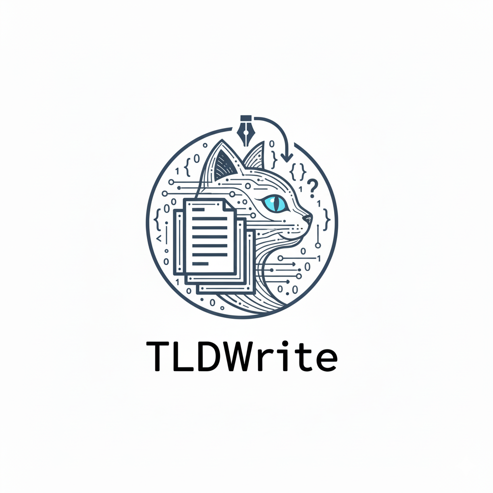

<div id="top">

<!-- HEADER STYLE: MODERN -->
<div align="left" style="position: relative; width: 100%; height: 100%; ">



# TLDWRITE

<em><em>

<!-- BADGES -->


<em>Built with the tools and technologies:</em>


<br>


</div>
</div>
<br clear="right">

---

## 📄 Table of Contents

- [📄 Table of Contents](#-table-of-contents)
- [✨ Overview](#-overview)
- [📌 Features](#-features)
- [📁 Project Structure](#-project-structure)
    - [📑 Project Index](#-project-index)
- [🚀 Getting Started](#-getting-started)
    - [📋 Prerequisites](#-prerequisites)
    - [⚙ ️ Installation](#-installation)
    - [💻 Usage](#-usage)
    - [🧪 Testing](#-testing)
- [📈 Roadmap](#-roadmap)
- [🤝 Contributing](#-contributing)
- [📜 License](#-license)
- [✨ Acknowledgments](#-acknowledgments)

---

## ✨ Overview


---

## 📌 Features

|      | Component       | Details                              |
| :--- | :-------------- | :----------------------------------- |
| ⚙️  | **Architecture**  | <ul><li>Python-based</li><li>Modular file structure</li></ul> |
| 🔩 | **Code Quality**  | <ul><li>Linting tools not specified</li><li>No explicit code analysis tools</li></ul> |
| 📄 | **Documentation** | <ul><li>Lacking detailed documentation</li><li>No README.md observed</li></ul> |
| 🔌 | **Integrations**  | <ul><li>Integrates with **OpenAI**, **Google APIs**</li><li>Aiohttp for async operations</li></ul> |
| 🧩 | **Modularity**    | <ul><li>Multiple TOML config files</li><li>Separation between source and dependencies</li></ul> |
| 🧪 | **Testing**       | <ul><li>No testing framework specified</li><li>Lacks automated test scripts</li></ul> |
| ⚡️  | **Performance**   | <ul><li>No explicit performance metrics</li><li>Async library usage for efficiency</li></ul> |
| 🛡️ | **Security**      | <ul><li>Dependencies management via `requirements.txt`</li><li>Security tools not defined</li></ul> |
| 📦 | **Dependencies**  | <ul><li>Extensive use of external libraries</li><li>Dependencies in `requirements.txt`</li></ul> |
| 🚀 | **Scalability**   | <ul><li>Leverages async features for scalability</li><li>Use of cloud-based APIs</li></ul> |
```

---

## 📁 Project Structure

```sh
└── tldwrite/
    ├── README.md
    ├── agents
    │   ├── .DS_Store
    │   ├── __init__.py
    │   ├── __pycache__
    │   ├── assets
    │   ├── cli
    │   ├── config
    │   ├── core
    │   ├── extractors
    │   ├── generators
    │   ├── models
    │   ├── parsers
    │   ├── postprocessor
    │   ├── preprocessor
    │   ├── retrievers
    │   └── utils
    ├── app.py
    ├── assets
    │   ├── .DS_Store
    │   ├── line.svg
    │   ├── logo.png
    │   └── stretch_logo.png
    ├── requirements.txt
    ├── scripts
    │   └── clean.sh
    ├── src
    │   ├── .DS_Store
    │   ├── __init__.py
    │   ├── __pycache__
    │   ├── config.py
    │   ├── main.py
    │   ├── src.egg-info
    │   └── utils
    ├── tests
    │   ├── __init__.py
    │   ├── conftest.py
    │   └── src
    └── tldwrite.png
```

### 📑 Project Index

<details open>
	<summary><b><code>TLDWRITE/</code></b></summary>
	<!-- __root__ Submodule -->
	<details>
		<summary><b>__root__</b></summary>
		<blockquote>
			<div class='directory-path' style='padding: 8px 0; color: #666;'>
				<code><b>⦿ __root__</b></code>
			<table style='width: 100%; border-collapse: collapse;'>
			<thead>
				<tr style='background-color: #f8f9fa;'>
					<th style='width: 30%; text-align: left; padding: 8px;'>File Name</th>
					<th style='text-align: left; padding: 8px;'>Summary</th>
				</tr>
			</thead>
				<tr style='border-bottom: 1px solid #eee;'>
					<td style='padding: 8px;'><b><a href='https://github.com/ZahrizhalAli/tldwrite/blob/master/requirements.txt'>requirements.txt</a></b></td>
					<td style='padding: 8px;'>- Outline the dependencies required for the project, ensuring compatibility with Python versions 3.9 to below 4.0<br>- The specified packages and their versions are crucial for managing external libraries and modules that the codebase relies on to function effectively<br>- This requirements file contributes to maintaining a stable and consistent development environment, enabling seamless installation and management of necessary Python packages throughout the projects lifecycle.</td>
				</tr>
				<tr style='border-bottom: 1px solid #eee;'>
					<td style='padding: 8px;'><b><a href='https://github.com/ZahrizhalAli/tldwrite/blob/master/app.py'>app.py</a></b></td>
					<td style='padding: 8px;'>- Streamlit application ReadmeAIApp facilitates the generation of customized README files for repositories using various options and configurations<br>- It allows users to specify repository details, select different AI models, and personalize output with styling options such as logos and badge styles<br>- The app captures user input, processes configurations, and dynamically generates detailed README documentation while providing feedback and error handling throughout the process.</td>
				</tr>
			</table>
		</blockquote>
	</details>
	<!-- scripts Submodule -->
	<details>
		<summary><b>scripts</b></summary>
		<blockquote>
			<div class='directory-path' style='padding: 8px 0; color: #666;'>
				<code><b>⦿ scripts</b></code>
			<table style='width: 100%; border-collapse: collapse;'>
			<thead>
				<tr style='background-color: #f8f9fa;'>
					<th style='width: 30%; text-align: left; padding: 8px;'>File Name</th>
					<th style='text-align: left; padding: 8px;'>Summary</th>
				</tr>
			</thead>
				<tr style='border-bottom: 1px solid #eee;'>
					<td style='padding: 8px;'><b><a href='https://github.com/ZahrizhalAli/tldwrite/blob/master/scripts/clean.sh'>clean.sh</a></b></td>
					<td style='padding: 8px;'>- Script facilitates the maintenance of the project environment by cleaning up various unnecessary and temporary files generated during development<br>- This includes the removal of build artifacts, Python file artifacts, test and coverage data, and backup and cache files<br>- It helps streamline the development process by ensuring that the codebase remains organized, free of redundant files, and ready for fresh builds or tests.</td>
				</tr>
			</table>
		</blockquote>
	</details>
	<!-- src Submodule -->
	<details>
		<summary><b>src</b></summary>
		<blockquote>
			<div class='directory-path' style='padding: 8px 0; color: #666;'>
				<code><b>⦿ src</b></code>
			<table style='width: 100%; border-collapse: collapse;'>
			<thead>
				<tr style='background-color: #f8f9fa;'>
					<th style='width: 30%; text-align: left; padding: 8px;'>File Name</th>
					<th style='text-align: left; padding: 8px;'>Summary</th>
				</tr>
			</thead>
				<tr style='border-bottom: 1px solid #eee;'>
					<td style='padding: 8px;'><b><a href='https://github.com/ZahrizhalAli/tldwrite/blob/master/src/config.py'>config.py</a></b></td>
					<td style='padding: 8px;'>- Centralizes configuration management for the project by loading settings from environment variables, YAML files, and command-line arguments<br>- It utilizes Pydantic models for validating and structuring configuration data across various components like the Analyzer, Documenter, and AI Rules Generator<br>- This ensures that all components in the codebase are consistently configured for seamless operation and integration with external tools and services.</td>
				</tr>
				<tr style='border-bottom: 1px solid #eee;'>
					<td style='padding: 8px;'><b><a href='https://github.com/ZahrizhalAli/tldwrite/blob/master/src/main.py'>main.py</a></b></td>
					<td style='padding: 8px;'>- Facilitates the retrieval and display of the GEMINI_API_KEY environment variable by loading environment settings through the dotenv library and accessing the key with the os module<br>- This function is crucial for enabling secure access to the Gemini API within the projects architecture, ensuring that necessary credentials are managed efficiently across the application.</td>
				</tr>
			</table>
			<!-- utils Submodule -->
			<details>
				<summary><b>utils</b></summary>
				<blockquote>
					<div class='directory-path' style='padding: 8px 0; color: #666;'>
						<code><b>⦿ src.utils</b></code>
					<table style='width: 100%; border-collapse: collapse;'>
					<thead>
						<tr style='background-color: #f8f9fa;'>
							<th style='width: 30%; text-align: left; padding: 8px;'>File Name</th>
							<th style='text-align: left; padding: 8px;'>Summary</th>
						</tr>
					</thead>
						<tr style='border-bottom: 1px solid #eee;'>
							<td style='padding: 8px;'><b><a href='https://github.com/ZahrizhalAli/tldwrite/blob/master/src/utils/dict.py'>dict.py</a></b></td>
							<td style='padding: 8px;'>- Facilitates the integration of two dictionaries within the larger codebase architecture, enabling seamless data merging where nested structures coexist<br>- Serves as a utility function to efficiently consolidate configurations or datasets, ensuring that overlapping keys are combined rather than overwritten<br>- Enhances the project’s data handling capabilities by maintaining hierarchical data structure integrity during the merge process, supporting more complex data manipulation and configuration tasks.</td>
						</tr>
					</table>
				</blockquote>
			</details>
			<!-- src.egg-info Submodule -->
			<details>
				<summary><b>src.egg-info</b></summary>
				<blockquote>
					<div class='directory-path' style='padding: 8px 0; color: #666;'>
						<code><b>⦿ src.src.egg-info</b></code>
					<table style='width: 100%; border-collapse: collapse;'>
					<thead>
						<tr style='background-color: #f8f9fa;'>
							<th style='width: 30%; text-align: left; padding: 8px;'>File Name</th>
							<th style='text-align: left; padding: 8px;'>Summary</th>
						</tr>
					</thead>
						<tr style='border-bottom: 1px solid #eee;'>
							<td style='padding: 8px;'><b><a href='https://github.com/ZahrizhalAli/tldwrite/blob/master/src/src.egg-info/PKG-INFO'>PKG-INFO</a></b></td>
							<td style='padding: 8px;'>- The project focuses on generating automated README files using AI, with an emphasis on simplicity, customization, and enhancing developer productivity<br>- It utilizes Python and requires the ReadmeAI and Streamlit libraries, among others, for functionality<br>- The project offers tools for authors to easily create polished documentation, catering to developers who seek efficiency in managing project documentation through AI-driven solutions.</td>
						</tr>
						<tr style='border-bottom: 1px solid #eee;'>
							<td style='padding: 8px;'><b><a href='https://github.com/ZahrizhalAli/tldwrite/blob/master/src/src.egg-info/SOURCES.txt'>SOURCES.txt</a></b></td>
							<td style='padding: 8px;'>- Outline the composition and dependencies of the software package, playing a crucial role in maintaining project integrity and facilitating seamless builds<br>- The information it provides supports developers in understanding project components and assists in the coordination of development activities by documenting the structure essential for deploying and integrating the application within its larger architecture.</td>
						</tr>
						<tr style='border-bottom: 1px solid #eee;'>
							<td style='padding: 8px;'><b><a href='https://github.com/ZahrizhalAli/tldwrite/blob/master/src/src.egg-info/requires.txt'>requires.txt</a></b></td>
							<td style='padding: 8px;'>- Defines the dependencies and development tools required for the project, ensuring consistency in development and testing environments<br>- It includes essential frameworks for running the main application, development tools for code quality, and testing libraries to facilitate comprehensive and efficient testing processes<br>- By specifying these dependencies, the codebase structure promotes collaborative development and seamless integration across different stages of the projects lifecycle.</td>
						</tr>
						<tr style='border-bottom: 1px solid #eee;'>
							<td style='padding: 8px;'><b><a href='https://github.com/ZahrizhalAli/tldwrite/blob/master/src/src.egg-info/top_level.txt'>top_level.txt</a></b></td>
							<td style='padding: 8px;'>- Defines the primary packages and modules included in the project, establishing a foundational reference for the codebase architecture<br>- By detailing the top-level components such as initialization and application modules, it enables developers to understand the main structural segmentation and organization, aiding in the navigation and comprehension of the softwares broader functionality and purpose within the overall system.</td>
						</tr>
						<tr style='border-bottom: 1px solid #eee;'>
							<td style='padding: 8px;'><b><a href='https://github.com/ZahrizhalAli/tldwrite/blob/master/src/src.egg-info/dependency_links.txt'>dependency_links.txt</a></b></td>
							<td style='padding: 8px;'>- Documenting essential links to the dependencies within the projects codebase, the file serves as a reference for managing external libraries and modules needed for the systems operation<br>- It aids developers in maintaining an updated and consistent set of dependencies, ensuring that all necessary external resources are accessible and up-to-date for efficient execution and collaboration across the development team.</td>
						</tr>
					</table>
				</blockquote>
			</details>
		</blockquote>
	</details>
	<!-- agents Submodule -->
	<details>
		<summary><b>agents</b></summary>
		<blockquote>
			<div class='directory-path' style='padding: 8px 0; color: #666;'>
				<code><b>⦿ agents</b></code>
			<!-- parsers Submodule -->
			<details>
				<summary><b>parsers</b></summary>
				<blockquote>
					<div class='directory-path' style='padding: 8px 0; color: #666;'>
						<code><b>⦿ agents.parsers</b></code>
					<table style='width: 100%; border-collapse: collapse;'>
					<thead>
						<tr style='background-color: #f8f9fa;'>
							<th style='width: 30%; text-align: left; padding: 8px;'>File Name</th>
							<th style='text-align: left; padding: 8px;'>Summary</th>
						</tr>
					</thead>
						<tr style='border-bottom: 1px solid #eee;'>
							<td style='padding: 8px;'><b><a href='https://github.com/ZahrizhalAli/tldwrite/blob/master/agents/parsers/properties.py'>properties.py</a></b></td>
							<td style='padding: 8px;'>- Parsing of *.properties configuration files identifies and extracts technology-related keywords and dependencies<br>- This function enhances the greater codebase by facilitating automated technology recognition and dependency management, which streamlines cross-platform integration and deployment processes<br>- It achieves this by leveraging a predefined list of common technical terms and employing techniques to clean and analyze lines within the configuration files effectively.</td>
						</tr>
						<tr style='border-bottom: 1px solid #eee;'>
							<td style='padding: 8px;'><b><a href='https://github.com/ZahrizhalAli/tldwrite/blob/master/agents/parsers/factory.py'>factory.py</a></b></td>
							<td style='padding: 8px;'>- The ParserFactory facilitates the creation of parsers for various dependency files within the project<br>- It maps file names to specific parser classes tailored for different languages and technologies, such as Python, C++, Go, and Docker<br>- By determining the appropriate parser for a given file name, the factory streamlines the process of parsing these files and managing dependencies throughout the codebase.</td>
						</tr>
						<tr style='border-bottom: 1px solid #eee;'>
							<td style='padding: 8px;'><b><a href='https://github.com/ZahrizhalAli/tldwrite/blob/master/agents/parsers/docker.py'>docker.py</a></b></td>
							<td style='padding: 8px;'>- Providing a core component of the codebase, the parsers for Dockerfile and docker-compose.yaml facilitate the extraction of dependencies and service details<br>- Parsing capabilities include identifying base images and versions from Dockerfiles, and extracting service configurations such as environment variables, ports, networks, and commands from docker-compose files, contributing to systematic configuration management and deployment processes within the project.</td>
						</tr>
						<tr style='border-bottom: 1px solid #eee;'>
							<td style='padding: 8px;'><b><a href='https://github.com/ZahrizhalAli/tldwrite/blob/master/agents/parsers/npm.py'>npm.py</a></b></td>
							<td style='padding: 8px;'>- Parsing npm dependency files, specifically <code>package.json</code>, is the primary purpose of this module<br>- It extracts and returns a list of dependencies from the given content, focusing on sections such as dependencies, devDependencies, and peerDependencies<br>- Positioned within the broader architecture, the parser enhances the automated process of managing, analyzing, and understanding npm package dependencies across the codebase, facilitating seamless integration and dependency resolution.</td>
						</tr>
						<tr style='border-bottom: 1px solid #eee;'>
							<td style='padding: 8px;'><b><a href='https://github.com/ZahrizhalAli/tldwrite/blob/master/agents/parsers/cpp.py'>cpp.py</a></b></td>
							<td style='padding: 8px;'>- Parse dependencies in C/C++ projects by utilizing specialized parsers for common build configuration files like CMakeLists.txt, configure.ac, and Makefile.am<br>- Each parser class identifies relevant libraries and packages by extracting key data from these files, enhancing automated dependency management within the software development lifecycle<br>- This modular approach simplifies integrating and maintaining complex C/C++ projects within the overarching codebase architecture.</td>
						</tr>
						<tr style='border-bottom: 1px solid #eee;'>
							<td style='padding: 8px;'><b><a href='https://github.com/ZahrizhalAli/tldwrite/blob/master/agents/parsers/gradle.py'>gradle.py</a></b></td>
							<td style='padding: 8px;'>- Facilitates parsing of Gradle dependency files to extract package names, enhancing dependency management within the codebase<br>- It supports both <code>build.gradle</code> and <code>build.gradle.kts</code> files, crucial for analyzing and processing Java and Kotlin projects<br>- By identifying dependencies, it assists in maintaining and updating project dependencies efficiently, playing a significant role in project configuration and build automation workflows.</td>
						</tr>
						<tr style='border-bottom: 1px solid #eee;'>
							<td style='padding: 8px;'><b><a href='https://github.com/ZahrizhalAli/tldwrite/blob/master/agents/parsers/swift.py'>swift.py</a></b></td>
							<td style='padding: 8px;'>- Provide functionality to parse and extract package names from Swift Package.swift files within the codebase<br>- This is accomplished by identifying and retrieving package details from URL and name declarations found in the projects configuration files<br>- Enhancing the overall systems capability to handle Swift dependencies efficiently, it ensures accurate dependency management by isolating relevant package information necessary for downstream processes.</td>
						</tr>
						<tr style='border-bottom: 1px solid #eee;'>
							<td style='padding: 8px;'><b><a href='https://github.com/ZahrizhalAli/tldwrite/blob/master/agents/parsers/python.py'>python.py</a></b></td>
							<td style='padding: 8px;'>- The file serves as a comprehensive tool for parsing various Python dependency files, including requirements.txt, TOML, and YAML formats<br>- It efficiently extracts package names by excluding comments, version specifiers, and special cases within different dependency management systems like Poetry, Pipenv, and Conda<br>- This functionality is integral to the projects architecture for managing and analyzing package dependencies in a streamlined and systematic way.</td>
						</tr>
						<tr style='border-bottom: 1px solid #eee;'>
							<td style='padding: 8px;'><b><a href='https://github.com/ZahrizhalAli/tldwrite/blob/master/agents/parsers/go.py'>go.py</a></b></td>
							<td style='padding: 8px;'>- Facilitates the extraction of package names from go.mod files to support dependency management within a Go language project<br>- By utilizing regular expressions to parse these files, it integrates seamlessly into the broader architecture aimed at managing and analyzing software dependencies<br>- Contributes to automating the process of identifying and handling dependencies, thereby enhancing the efficiency and maintainability of the codebase.</td>
						</tr>
						<tr style='border-bottom: 1px solid #eee;'>
							<td style='padding: 8px;'><b><a href='https://github.com/ZahrizhalAli/tldwrite/blob/master/agents/parsers/maven.py'>maven.py</a></b></td>
							<td style='padding: 8px;'>- Provide a structured way to extract dependency information from Maven pom.xml files within a Java-based project<br>- By identifying and isolating package names, especially those related to the Spring framework, the parser enhances the projects ability to analyze and manage dependencies<br>- This supports efficient dependency tracking and integration within the larger architecture, contributing to streamlined software maintenance and updates.</td>
						</tr>
						<tr style='border-bottom: 1px solid #eee;'>
							<td style='padding: 8px;'><b><a href='https://github.com/ZahrizhalAli/tldwrite/blob/master/agents/parsers/base.py'>base.py</a></b></td>
							<td style='padding: 8px;'>- Serves as an abstract foundation for dependency file parsers within the project<br>- Provides a structure for implementing custom parsers while including a default parser for unknown file types<br>- Facilitates error logging and standardized error handling during parsing operations, reinforcing the reliability of dependency management across the entire codebase<br>- Utilizes a logger to manage error reporting effectively, ensuring smooth parser functionality and development adaptability.</td>
						</tr>
						<tr style='border-bottom: 1px solid #eee;'>
							<td style='padding: 8px;'><b><a href='https://github.com/ZahrizhalAli/tldwrite/blob/master/agents/parsers/rust.py'>rust.py</a></b></td>
							<td style='padding: 8px;'>- Facilitates dependency extraction from Rust <code>cargo.toml</code> files within a codebase ecosystem, focusing on identifying package names from both standard and development dependencies<br>- By parsing these configuration files, it supports larger objectives of dependency management, aiding in tasks like software analysis, maintenance, or automation<br>- This parser component integrates with a broader architecture aimed at understanding various programming environments through specialized file analysis.</td>
						</tr>
					</table>
				</blockquote>
			</details>
			<!-- core Submodule -->
			<details>
				<summary><b>core</b></summary>
				<blockquote>
					<div class='directory-path' style='padding: 8px 0; color: #666;'>
						<code><b>⦿ agents.core</b></code>
					<table style='width: 100%; border-collapse: collapse;'>
					<thead>
						<tr style='background-color: #f8f9fa;'>
							<th style='width: 30%; text-align: left; padding: 8px;'>File Name</th>
							<th style='text-align: left; padding: 8px;'>Summary</th>
						</tr>
					</thead>
						<tr style='border-bottom: 1px solid #eee;'>
							<td style='padding: 8px;'><b><a href='https://github.com/ZahrizhalAli/tldwrite/blob/master/agents/core/logger.py'>logger.py</a></b></td>
							<td style='padding: 8px;'>- Enhances the logging capabilities across the project by providing a customizable logger that supports color and emoji formatting for console output, as well as JSON formatting for structured logging<br>- The logger ensures consistent and dynamic log management through a singleton pattern, allowing developers to control log levels, formats, and output styles, thus improving the clarity and usability of log messages within the codebase.</td>
						</tr>
						<tr style='border-bottom: 1px solid #eee;'>
							<td style='padding: 8px;'><b><a href='https://github.com/ZahrizhalAli/tldwrite/blob/master/agents/core/pipeline.py'>pipeline.py</a></b></td>
							<td style='padding: 8px;'>- Orchestrates the automated creation of README.md files by analyzing the projects repository, processing the extracted context, and generating structured documentation<br>- Leverages AI models to enhance content creation and optionally integrates DALL-E for image generation<br>- Ensures consistent output through configuration settings, error handling, and logging, streamlining the documentation process and allowing customizable enhancements to maintain a polished and informative project overview.</td>
						</tr>
						<tr style='border-bottom: 1px solid #eee;'>
							<td style='padding: 8px;'><b><a href='https://github.com/ZahrizhalAli/tldwrite/blob/master/agents/core/errors.py'>errors.py</a></b></td>
							<td style='padding: 8px;'>- Define and handle custom exceptions within the ReadmeAI project, supporting various components such as the CLI, file system, Git operations, repository processing, and LLM API services<br>- Facilitate the identification and resolution of errors by categorizing them under specific contexts, enhancing the robustness and maintainability of the overall codebase architecture.</td>
						</tr>
					</table>
				</blockquote>
			</details>
			<!-- config Submodule -->
			<details>
				<summary><b>config</b></summary>
				<blockquote>
					<div class='directory-path' style='padding: 8px 0; color: #666;'>
						<code><b>⦿ agents.config</b></code>
					<table style='width: 100%; border-collapse: collapse;'>
					<thead>
						<tr style='background-color: #f8f9fa;'>
							<th style='width: 30%; text-align: left; padding: 8px;'>File Name</th>
							<th style='text-align: left; padding: 8px;'>Summary</th>
						</tr>
					</thead>
						<tr style='border-bottom: 1px solid #eee;'>
							<td style='padding: 8px;'><b><a href='https://github.com/ZahrizhalAli/tldwrite/blob/master/agents/config/settings.py'>settings.py</a></b></td>
							<td style='padding: 8px;'>- The <code>agents/config/settings.py</code> file defines configuration models for the readme-ai package, supporting structured configuration management across various components<br>- It facilitates setting defaults, constraints, and validations for file paths, Git repository attributes, markdown generation for README files, and language model settings for LLM API services, ensuring consistent and comprehensive setup of the package's operational parameters.</td>
						</tr>
					</table>
					<!-- settings Submodule -->
					<details>
						<summary><b>settings</b></summary>
						<blockquote>
							<div class='directory-path' style='padding: 8px 0; color: #666;'>
								<code><b>⦿ agents.config.settings</b></code>
							<table style='width: 100%; border-collapse: collapse;'>
							<thead>
								<tr style='background-color: #f8f9fa;'>
									<th style='width: 30%; text-align: left; padding: 8px;'>File Name</th>
									<th style='text-align: left; padding: 8px;'>Summary</th>
								</tr>
							</thead>
								<tr style='border-bottom: 1px solid #eee;'>
									<td style='padding: 8px;'><b><a href='https://github.com/ZahrizhalAli/tldwrite/blob/master/agents/config/settings/prompts.toml'>prompts.toml</a></b></td>
									<td style='padding: 8px;'>- Summary>Defines large language model (LLM) prompts used for various text generation tasks within the project architecture, facilitating coherent and consistent interaction with the LLM<br>- Supports functionality across multiple files by storing structured prompt templates for code analysis, summaries, taglines, and overviews within a configuration file, ensuring standard communication patterns and efficient prompt management.</summary></td>
								</tr>
								<tr style='border-bottom: 1px solid #eee;'>
									<td style='padding: 8px;'><b><a href='https://github.com/ZahrizhalAli/tldwrite/blob/master/agents/config/settings/project-manifest.toml'>project-manifest.toml</a></b></td>
									<td style='padding: 8px;'>- The project-manifest file serves as a comprehensive configuration guide, identifying essential parsers and associated files across multiple domains, such as CI/CD, configuration, infrastructure, monitoring, orchestration, package management, properties, and language-specific frameworks<br>- By doing so, it facilitates the parsing and analysis of diverse project files, ensuring that the codebase architecture accommodates varied development and operational requirements efficiently.</td>
								</tr>
								<tr style='border-bottom: 1px solid #eee;'>
									<td style='padding: 8px;'><b><a href='https://github.com/ZahrizhalAli/tldwrite/blob/master/agents/config/settings/language-map.toml'>language-map.toml</a></b></td>
									<td style='padding: 8px;'>- The language-map.toml file serves as a mapping reference within the broader codebase architecture, linking file extensions to their respective programming language names<br>- This facilitates language detection and categorization across the project, supporting features that rely on understanding the programming language context<br>- It enhances functionality by standardizing language identification, aiding in operations like code analysis, compilation, or reporting within the system.</td>
								</tr>
								<tr style='border-bottom: 1px solid #eee;'>
									<td style='padding: 8px;'><b><a href='https://github.com/ZahrizhalAli/tldwrite/blob/master/agents/config/settings/dev-setup.toml'>dev-setup.toml</a></b></td>
									<td style='padding: 8px;'>- The file agents/config/settings/dev-setup.toml serves as a configuration blueprint for integrating Docker into the development environment of the project<br>- Its main purpose is to outline and standardize the setup and usage commands for Docker, ensuring consistent development practices across the team<br>- By specifying install, usage, and test commands, along with supported file extensions like Dockerfile and docker-compose variants, it aids developers in streamlining container management and facilitating the creation and deployment of application containers<br>- This setup is crucial for maintaining cohesive development and deployment workflows within the project's architecture.</td>
								</tr>
								<tr style='border-bottom: 1px solid #eee;'>
									<td style='padding: 8px;'><b><a href='https://github.com/ZahrizhalAli/tldwrite/blob/master/agents/config/settings/config.toml'>config.toml</a></b></td>
									<td style='padding: 8px;'>- The configuration file <code>config.toml</code> specifies the settings for the <code>readme-ai</code> project within the codebase<br>- It organizes templates, dynamic elements such as badges, contributes to the structure of README sections, and manages API integrations with platforms like OpenAI<br>- This setup facilitates consistent project documentation and contributes to the overall development and maintenance framework by streamlining configuration and customization options.</td>
								</tr>
								<tr style='border-bottom: 1px solid #eee;'>
									<td style='padding: 8px;'><b><a href='https://github.com/ZahrizhalAli/tldwrite/blob/master/agents/config/settings/badge-list.toml'>badge-list.toml</a></b></td>
									<td style='padding: 8px;'>- The file defines a list of tools used for enforcing code style and formatting conventions within the project<br>- It acts as a centralized configuration reference to ensure consistent code quality across different codebases and development environments<br>- By cataloging these tools, it supports developers in maintaining a uniform code style, which enhances readability, reduces errors, and facilitates collaboration within the team.</td>
								</tr>
								<tr style='border-bottom: 1px solid #eee;'>
									<td style='padding: 8px;'><b><a href='https://github.com/ZahrizhalAli/tldwrite/blob/master/agents/config/settings/ignore-list.toml'>ignore-list.toml</a></b></td>
									<td style='padding: 8px;'>- The ignore-list.toml file specifies directories, file extensions, and file names that are excluded from the preprocessing stage of the project<br>- By defining these exclusions, it streamlines the codebase management, ensuring that unnecessary or irrelevant files do not interfere with data processing and analysis<br>- This enhances efficiency and focus in handling essential components of the project, ultimately contributing to a more organized and effective workflow.</td>
								</tr>
								<tr style='border-bottom: 1px solid #eee;'>
									<td style='padding: 8px;'><b><a href='https://github.com/ZahrizhalAli/tldwrite/blob/master/agents/config/settings/dev-tools.toml'>dev-tools.toml</a></b></td>
									<td style='padding: 8px;'>- The dev-tools.toml configuration file serves as a universal master list, mapping various programming environments and ecosystems to their respective package managers, configuration files, and runtime tools<br>- It provides a comprehensive reference for managing dependencies, building, testing, cloud services, and deployment across multiple languages and technologies, ensuring consistent and efficient handling throughout the entire codebase architecture.</td>
								</tr>
								<tr style='border-bottom: 1px solid #eee;'>
									<td style='padding: 8px;'><b><a href='https://github.com/ZahrizhalAli/tldwrite/blob/master/agents/config/settings/commands.toml'>commands.toml</a></b></td>
									<td style='padding: 8px;'>- Defines standardized commands for installing, running, and testing applications across various programming languages within the codebase architecture<br>- By specifying these commands in a TOML configuration file, the project ensures consistency and ease of use for developers working with multiple languages<br>- This approach streamlines the development and deployment process, promoting efficiency and reducing setup time for new projects or languages.</td>
								</tr>
								<tr style='border-bottom: 1px solid #eee;'>
									<td style='padding: 8px;'><b><a href='https://github.com/ZahrizhalAli/tldwrite/blob/master/agents/config/settings/templates.toml'>templates.toml</a></b></td>
									<td style='padding: 8px;'>- Facilitates the creation of structured and consistent README.md files by providing predefined markdown templates<br>- Each template is designed to cater to different levels of detail, ranging from a comprehensive format with sections for features, structure, and contributions, to a more minimalistic version focused on essential details<br>- Enhances project documentation by ensuring important information is uniformly presented across different repositories.</td>
								</tr>
							</table>
							<!-- templates Submodule -->
							<details>
								<summary><b>templates</b></summary>
								<blockquote>
									<div class='directory-path' style='padding: 8px 0; color: #666;'>
										<code><b>⦿ agents.config.settings.templates</b></code>
									<table style='width: 100%; border-collapse: collapse;'>
									<thead>
										<tr style='background-color: #f8f9fa;'>
											<th style='width: 30%; text-align: left; padding: 8px;'>File Name</th>
											<th style='text-align: left; padding: 8px;'>Summary</th>
										</tr>
									</thead>
										<tr style='border-bottom: 1px solid #eee;'>
											<td style='padding: 8px;'><b><a href='https://github.com/ZahrizhalAli/tldwrite/blob/master/agents/config/settings/templates/headers.toml'>headers.toml</a></b></td>
											<td style='padding: 8px;'>- Provide customizable header style templates for README files, enhancing their visual and informational appeal<br>- These templates support various styles such as ASCII, BANNER, CLASSIC, and MODERN, allowing for diverse presentations of logos, taglines, badges, and tech stacks<br>- By using these styles, the architecture aims to streamline README content creation, ensuring consistency and professionalism across projects.</td>
										</tr>
										<tr style='border-bottom: 1px solid #eee;'>
											<td style='padding: 8px;'><b><a href='https://github.com/ZahrizhalAli/tldwrite/blob/master/agents/config/settings/templates/banners.toml'>banners.toml</a></b></td>
											<td style='padding: 8px;'>- The SVG banner template in the project provides customizable designs for README headers, enhancing visual appeal and branding<br>- It utilizes scalable vector graphics to allow flexibility in design elements such as color gradients, shadows, and patterns<br>- Key parameters such as width, height, and typography are adjustable, supporting diversity in presentation while maintaining consistency across different README files within the codebase.</td>
										</tr>
										<tr style='border-bottom: 1px solid #eee;'>
											<td style='padding: 8px;'><b><a href='https://github.com/ZahrizhalAli/tldwrite/blob/master/agents/config/settings/templates/quickstart.toml'>quickstart.toml</a></b></td>
											<td style='padding: 8px;'>- Facilitates the creation of quick start guides by providing structured templates for projects, including sections for prerequisites, installation, usage, and testing<br>- Tailors the content using placeholders for specific project details, such as system requirements and installation steps<br>- Streamlines guide generation, ensuring consistency and completeness across different projects, thus supporting users in successfully setting up and utilizing the codebase efficiently.</td>
										</tr>
									</table>
								</blockquote>
							</details>
							<!-- themes Submodule -->
							<details>
								<summary><b>themes</b></summary>
								<blockquote>
									<div class='directory-path' style='padding: 8px 0; color: #666;'>
										<code><b>⦿ agents.config.settings.themes</b></code>
									<table style='width: 100%; border-collapse: collapse;'>
									<thead>
										<tr style='background-color: #f8f9fa;'>
											<th style='width: 30%; text-align: left; padding: 8px;'>File Name</th>
											<th style='text-align: left; padding: 8px;'>Summary</th>
										</tr>
									</thead>
										<tr style='border-bottom: 1px solid #eee;'>
											<td style='padding: 8px;'><b><a href='https://github.com/ZahrizhalAli/tldwrite/blob/master/agents/config/settings/themes/emojis.yaml'>emojis.yaml</a></b></td>
											<td style='padding: 8px;'>- The file <code>agents/config/settings/themes/emojis.yaml</code> is part of the projects configuration system designed to enhance the customization of README header sections with emojis<br>- It provides a structure for defining various emoji theme packs" that users can contribute to or modify according to their needs<br>- Each theme is categorized and includes a name, description, and customizable sections, allowing users to tailor documentation aesthetics in line with project design preferences<br>- This enhances readability and engagement by visually customizing documentation components across the project.</td>
										</tr>
									</table>
								</blockquote>
							</details>
						</blockquote>
					</details>
				</blockquote>
			</details>
			<!-- postprocessor Submodule -->
			<details>
				<summary><b>postprocessor</b></summary>
				<blockquote>
					<div class='directory-path' style='padding: 8px 0; color: #666;'>
						<code><b>⦿ agents.postprocessor</b></code>
					<table style='width: 100%; border-collapse: collapse;'>
					<thead>
						<tr style='background-color: #f8f9fa;'>
							<th style='width: 30%; text-align: left; padding: 8px;'>File Name</th>
							<th style='text-align: left; padding: 8px;'>Summary</th>
						</tr>
					</thead>
						<tr style='border-bottom: 1px solid #eee;'>
							<td style='padding: 8px;'><b><a href='https://github.com/ZahrizhalAli/tldwrite/blob/master/agents/postprocessor/markdown_to_html.py'>markdown_to_html.py</a></b></td>
							<td style='padding: 8px;'>- Conversion of markdown syntax to HTML elements is the key function of this module within the project architecture<br>- It supports various markdown features like bold, italic, links, headers, and lists, ensuring they are translated into compatible HTML for integration with ReadmeAIs table content in README files<br>- Efficient processing is maintained through precompiled regular expressions to enhance performance.</td>
						</tr>
						<tr style='border-bottom: 1px solid #eee;'>
							<td style='padding: 8px;'><b><a href='https://github.com/ZahrizhalAli/tldwrite/blob/master/agents/postprocessor/response_cleaner.py'>response_cleaner.py</a></b></td>
							<td style='padding: 8px;'>- Utility functions clean and format responses generated by LLM APIs, ensuring output consistency and readability<br>- The functions address common formatting issues, such as malformed Markdown tables, improper markdown syntax, uneven text formatting, and extraneous characters<br>- They prepare clean and structured text by extracting relevant content and eliminating unnecessary elements, contributing to a robust post-processing layer in the codebase.</td>
						</tr>
					</table>
				</blockquote>
			</details>
			<!-- utils Submodule -->
			<details>
				<summary><b>utils</b></summary>
				<blockquote>
					<div class='directory-path' style='padding: 8px 0; color: #666;'>
						<code><b>⦿ agents.utils</b></code>
					<table style='width: 100%; border-collapse: collapse;'>
					<thead>
						<tr style='background-color: #f8f9fa;'>
							<th style='width: 30%; text-align: left; padding: 8px;'>File Name</th>
							<th style='text-align: left; padding: 8px;'>Summary</th>
						</tr>
					</thead>
						<tr style='border-bottom: 1px solid #eee;'>
							<td style='padding: 8px;'><b><a href='https://github.com/ZahrizhalAli/tldwrite/blob/master/agents/utils/file_handler.py'>file_handler.py</a></b></td>
							<td style='padding: 8px;'>- Facilitates file input and output operations across multiple formats, including HTML, JSON, Markdown, TOML, TXT, and YAML, by providing a centralized utility class<br>- Enhances file handling efficiency with caching mechanisms to improve performance on reads<br>- Supports read and write operations for most formats but restricts TOML to read-only mode<br>- Integrates error handling to manage exceptions during file operations, ensuring robustness in broader architectural applications.</td>
						</tr>
						<tr style='border-bottom: 1px solid #eee;'>
							<td style='padding: 8px;'><b><a href='https://github.com/ZahrizhalAli/tldwrite/blob/master/agents/utils/importer.py'>importer.py</a></b></td>
							<td style='padding: 8px;'>- Facilitates dynamic functionality by checking if specified modules are available for import within the codebase<br>- Enhancing modularity, it supports the broader project by ensuring necessary dependencies can be dynamically verified and loaded, allowing for flexibility in managing optional or conditionally required components<br>- This utility ensures smoother integration and execution across various parts of the architecture without hard dependencies.</td>
						</tr>
						<tr style='border-bottom: 1px solid #eee;'>
							<td style='padding: 8px;'><b><a href='https://github.com/ZahrizhalAli/tldwrite/blob/master/agents/utils/resource_manager.py'>resource_manager.py</a></b></td>
							<td style='padding: 8px;'>- Facilitates access to package resource files by constructing their full paths within the projects modular structure<br>- It initially leverages importlib.resources for resource retrieval and provides a fallback to pkg_resources to ensure robust access across modules, specifically within configuration settings<br>- Enhances error management by logging errors and raising custom exceptions when resource files cannot be loaded, thereby supporting seamless system configuration and resource management.</td>
						</tr>
						<tr style='border-bottom: 1px solid #eee;'>
							<td style='padding: 8px;'><b><a href='https://github.com/ZahrizhalAli/tldwrite/blob/master/agents/utils/fetch_badges.py'>fetch_badges.py</a></b></td>
							<td style='padding: 8px;'>- The code updates and manages badge data by fetching it from an external GitHub repository<br>- It normalizes, transforms, and merges the badge data, ensuring consistency and preventing duplication<br>- The code also handles potential errors and saves the processed data locally, contributing to the badge management component of the projects larger system architecture<br>- This facilitates seamless integration and accessibility of updated badge resources.</td>
						</tr>
					</table>
				</blockquote>
			</details>
			<!-- models Submodule -->
			<details>
				<summary><b>models</b></summary>
				<blockquote>
					<div class='directory-path' style='padding: 8px 0; color: #666;'>
						<code><b>⦿ agents.models</b></code>
					<table style='width: 100%; border-collapse: collapse;'>
					<thead>
						<tr style='background-color: #f8f9fa;'>
							<th style='width: 30%; text-align: left; padding: 8px;'>File Name</th>
							<th style='text-align: left; padding: 8px;'>Summary</th>
						</tr>
					</thead>
						<tr style='border-bottom: 1px solid #eee;'>
							<td style='padding: 8px;'><b><a href='https://github.com/ZahrizhalAli/tldwrite/blob/master/agents/models/enums.py'>enums.py</a></b></td>
							<td style='padding: 8px;'>- Defines enumerated types for managing API keys and supported models and services within the LLM architecture<br>- By categorizing keys and models for various LLM providers such as Anthropic, Gemini, Ollama, and OpenAI, it standardizes how external API services are accessed and used across the project<br>- The organization also covers API base URLs, enhancing the modularity and scalability of integrating additional services in the future.</td>
						</tr>
						<tr style='border-bottom: 1px solid #eee;'>
							<td style='padding: 8px;'><b><a href='https://github.com/ZahrizhalAli/tldwrite/blob/master/agents/models/offline.py'>offline.py</a></b></td>
							<td style='padding: 8px;'>- Facilitating operation in environments lacking an LLM API, the OfflineHandler serves as a backend component within the architectures of agents<br>- It manages configuration and context while emulating API interactions by providing placeholder responses<br>- This enables command-line interface functionalities and ensures adaptability and consistency across different repository contexts even when direct API access is unavailable.</td>
						</tr>
						<tr style='border-bottom: 1px solid #eee;'>
							<td style='padding: 8px;'><b><a href='https://github.com/ZahrizhalAli/tldwrite/blob/master/agents/models/gemini.py'>gemini.py</a></b></td>
							<td style='padding: 8px;'>- Implementing Google Gemini LLM API services, the GeminiHandler integrates within the codebase to facilitate text generation by communicating with Googles generative AI<br>- It manages configurations, handles API requests with retries, and processes responses, providing generated content while ensuring error handling and logging<br>- It requires the Google Generative AI library and is integral to projects utilizing advanced language models.</td>
						</tr>
						<tr style='border-bottom: 1px solid #eee;'>
							<td style='padding: 8px;'><b><a href='https://github.com/ZahrizhalAli/tldwrite/blob/master/agents/models/tokens.py'>tokens.py</a></b></td>
							<td style='padding: 8px;'>- Facilitates token management and optimization for large language model prompts by calculating and adjusting token counts based on encoding specifications<br>- Incorporates logging for debugging and handles potential encoding errors while optimizing prompts to fit within defined token limits<br>- Supports efficient processing in a large-scale AI environment by ensuring prompts align with model constraints, enhancing overall system performance and reliability.</td>
						</tr>
						<tr style='border-bottom: 1px solid #eee;'>
							<td style='padding: 8px;'><b><a href='https://github.com/ZahrizhalAli/tldwrite/blob/master/agents/models/dalle.py'>dalle.py</a></b></td>
							<td style='padding: 8px;'>- Enable the generation and downloading of project logos utilizing OpenAIs DALL-E model<br>- The tool is designed for users of the OpenAI API, leveraging config data to tailor a logo according to project details<br>- Includes error handling for robust operation, and persists images locally, facilitating the incorporation of customized visual branding within the broader project architecture.</td>
						</tr>
						<tr style='border-bottom: 1px solid #eee;'>
							<td style='padding: 8px;'><b><a href='https://github.com/ZahrizhalAli/tldwrite/blob/master/agents/models/factory.py'>factory.py</a></b></td>
							<td style='padding: 8px;'>- ModelFactory centralizes the instantiation of various LLM API handlers within the project architecture<br>- By mapping specific LLM providers to their respective handlers, it facilitates dynamic selection and integration of language model services based on configuration settings<br>- This design ensures flexibility and scalability, enabling the system to adapt to different LLM services seamlessly while maintaining consistent interaction through a unified interface.</td>
						</tr>
						<tr style='border-bottom: 1px solid #eee;'>
							<td style='padding: 8px;'><b><a href='https://github.com/ZahrizhalAli/tldwrite/blob/master/agents/models/prompts.py'>prompts.py</a></b></td>
							<td style='padding: 8px;'>- Facilitates prompt generation for large language model integrations within the codebase, focusing on text creation for various components such as features, overviews, and taglines<br>- Utilizes project settings and repository context to dynamically construct prompts using predefined templates<br>- Supports README content through additional prompt settings and manages context integration, ensuring relevant input information is injected into templates for accurate and coherent text generation.</td>
						</tr>
						<tr style='border-bottom: 1px solid #eee;'>
							<td style='padding: 8px;'><b><a href='https://github.com/ZahrizhalAli/tldwrite/blob/master/agents/models/openai.py'>openai.py</a></b></td>
							<td style='padding: 8px;'>- OpenAIHandler serves as an interface for handling interactions with OpenAIs API and Ollama local deployments<br>- It manages configuration settings and constructs requests for text generation, integrating error handling and retry mechanisms<br>- By supporting both remote and local models, it provides flexibility in model deployment, facilitating seamless communication with language models in various project components.</td>
						</tr>
						<tr style='border-bottom: 1px solid #eee;'>
							<td style='padding: 8px;'><b><a href='https://github.com/ZahrizhalAli/tldwrite/blob/master/agents/models/anthropic.py'>anthropic.py</a></b></td>
							<td style='padding: 8px;'>- Implementing the Anthropic LLM API service, the anthropic.py component serves as a handler for integrating Anthropics language model into the broader architecture<br>- It handles the setup, configuration, and execution of API requests for text generation, including error handling and retry mechanisms<br>- It facilitates robust interaction with the Anthropic API, allowing for seamless integration and response management within the projects context.</td>
						</tr>
						<tr style='border-bottom: 1px solid #eee;'>
							<td style='padding: 8px;'><b><a href='https://github.com/ZahrizhalAli/tldwrite/blob/master/agents/models/base.py'>base.py</a></b></td>
							<td style='padding: 8px;'>- BaseModelHandler serves as an abstract interface for managing requests to LLM APIs<br>- It handles configuration settings, constructs API payloads, and manages HTTP client sessions<br>- Additionally, it coordinates batch requests and processes responses, including generating and managing document summaries and additional context prompts<br>- The class plays a crucial role in integrating machine learning model interactions within the projects broader architecture.</td>
						</tr>
					</table>
				</blockquote>
			</details>
			<!-- cli Submodule -->
			<details>
				<summary><b>cli</b></summary>
				<blockquote>
					<div class='directory-path' style='padding: 8px 0; color: #666;'>
						<code><b>⦿ agents.cli</b></code>
					<table style='width: 100%; border-collapse: collapse;'>
					<thead>
						<tr style='background-color: #f8f9fa;'>
							<th style='width: 30%; text-align: left; padding: 8px;'>File Name</th>
							<th style='text-align: left; padding: 8px;'>Summary</th>
						</tr>
					</thead>
						<tr style='border-bottom: 1px solid #eee;'>
							<td style='padding: 8px;'><b><a href='https://github.com/ZahrizhalAli/tldwrite/blob/master/agents/cli/options.py'>options.py</a></b></td>
							<td style='padding: 8px;'>- The purpose of the file is to facilitate the customization of README files in the readme-ai package through a command-line interface<br>- It enables users to specify parameters such as logo, badge style, layout, API configuration, and theme for generating structured and visually appealing documentation<br>- This aids in improving the project documentation by tailoring it to user preferences while leveraging automated generation capabilities.</td>
						</tr>
						<tr style='border-bottom: 1px solid #eee;'>
							<td style='padding: 8px;'><b><a href='https://github.com/ZahrizhalAli/tldwrite/blob/master/agents/cli/main.py'>main.py</a></b></td>
							<td style='padding: 8px;'>- The command-line interface for the readme-ai project provides an entry point to configure and execute the applications operations<br>- By accepting various options, it allows users to customize settings related to the Git repository, language model, and markdown output<br>- The CLI facilitates the seamless integration of these configurations into the readme generation process, ensuring flexibility and tailored outputs for different project needs.</td>
						</tr>
					</table>
				</blockquote>
			</details>
			<!-- generators Submodule -->
			<details>
				<summary><b>generators</b></summary>
				<blockquote>
					<div class='directory-path' style='padding: 8px 0; color: #666;'>
						<code><b>⦿ agents.generators</b></code>
					<table style='width: 100%; border-collapse: collapse;'>
					<thead>
						<tr style='background-color: #f8f9fa;'>
							<th style='width: 30%; text-align: left; padding: 8px;'>File Name</th>
							<th style='text-align: left; padding: 8px;'>Summary</th>
						</tr>
					</thead>
						<tr style='border-bottom: 1px solid #eee;'>
							<td style='padding: 8px;'><b><a href='https://github.com/ZahrizhalAli/tldwrite/blob/master/agents/generators/tree.py'>tree.py</a></b></td>
							<td style='padding: 8px;'>- Generates a visual representation of a directory structure, aiding in the understanding and navigation of a projects file hierarchy<br>- This utility is particularly useful for documenting and sharing the architecture of a repository by converting the filesystem into an easy-to-read tree format<br>- Facilitates exploration by allowing customization of depth and presentation, enhancing accessibility and organization within the codebase.</td>
						</tr>
						<tr style='border-bottom: 1px solid #eee;'>
							<td style='padding: 8px;'><b><a href='https://github.com/ZahrizhalAli/tldwrite/blob/master/agents/generators/enums.py'>enums.py</a></b></td>
							<td style='padding: 8px;'>- Enums within the agents/generators/enums.py file serve to define customizable elements of a project README<br>- These enums establish various styles and options, such as badge icon styles, logo selections, emoji themes, header templates, and navigation menu styles<br>- This customization enhances the presentation and functionality of README files, enabling users to tailor documentation aesthetics to fit project needs and preferences within the overall codebase architecture.</td>
						</tr>
						<tr style='border-bottom: 1px solid #eee;'>
							<td style='padding: 8px;'><b><a href='https://github.com/ZahrizhalAli/tldwrite/blob/master/agents/generators/emojis.py'>emojis.py</a></b></td>
							<td style='padding: 8px;'>- Manage emoji-based themes for README documentation within the project<br>- Facilitate the organization, customization, and retrieval of section headers with emojis, enhancing visual appeal and navigability<br>- Employ section and subsection handling, with a robust theme registry to access predefined themes from configuration<br>- Enable dynamic theme switching and apply chosen themes consistently across headers, ensuring coherent documentation presentation according to user-specified settings.</td>
						</tr>
						<tr style='border-bottom: 1px solid #eee;'>
							<td style='padding: 8px;'><b><a href='https://github.com/ZahrizhalAli/tldwrite/blob/master/agents/generators/builder.py'>builder.py</a></b></td>
							<td style='padding: 8px;'>- The <code>MarkdownBuilder</code> class is central to generating a structured and thematically styled README.md document for the project<br>- It compiles various sections, including headers, badges, tables of contents, and quickstart guides, leveraging themes and templates<br>- The goal is to provide a comprehensive introduction to the projects structure, features, and usage, enhancing overall project readability and accessibility.</td>
						</tr>
						<tr style='border-bottom: 1px solid #eee;'>
							<td style='padding: 8px;'><b><a href='https://github.com/ZahrizhalAli/tldwrite/blob/master/agents/generators/badges.py'>badges.py</a></b></td>
							<td style='padding: 8px;'>- Generate SVG badges for README files by utilizing shields.io icons, facilitating the representation of code metrics and project dependencies<br>- The badges enhance documentation by visually summarizing important information about the project’s technology stack and development statistics<br>- This functionality integrates with various configuration settings, managing dynamic badge creation while supporting different styles and hosting scenarios, thereby enriching the overall documentation process.</td>
						</tr>
						<tr style='border-bottom: 1px solid #eee;'>
							<td style='padding: 8px;'><b><a href='https://github.com/ZahrizhalAli/tldwrite/blob/master/agents/generators/tables.py'>tables.py</a></b></td>
							<td style='padding: 8px;'>- Enhance the documentation process by generating structured HTML tables with nested submodules for project summaries<br>- It organizes summaries by module and submodule, creating a clear, expandable view while incorporating links to source files<br>- These tables facilitate easy navigation and understanding of project components, serving as a pivotal tool for improving code readability and project orientation within the codebase architecture.</td>
						</tr>
						<tr style='border-bottom: 1px solid #eee;'>
							<td style='padding: 8px;'><b><a href='https://github.com/ZahrizhalAli/tldwrite/blob/master/agents/generators/navigation.py'>navigation.py</a></b></td>
							<td style='padding: 8px;'>- Facilitates the generation of a table of contents or navigation menu for documentation, specifically for README files<br>- It employs various styles, including bullet, numbered, and Roman numeral formats, ensuring proper markdown formatting<br>- By integrating a header registry for theme consistency, it effectively handles themed titles and GitHub-compatible anchor links, enhancing the readability and organization of documentation within the projects architecture.</td>
						</tr>
						<tr style='border-bottom: 1px solid #eee;'>
							<td style='padding: 8px;'><b><a href='https://github.com/ZahrizhalAli/tldwrite/blob/master/agents/generators/headers.py'>headers.py</a></b></td>
							<td style='padding: 8px;'>- Facilitates the creation and management of header templates for README files by defining standard sections, their order, and aliases<br>- Supports a variety of header styles and theming configurations, including handling emojis and section formatting<br>- Provides a centralized registry to manage header configurations, including rendering templates with specified data, allowing consistent documentation structure across a project.</td>
						</tr>
						<tr style='border-bottom: 1px solid #eee;'>
							<td style='padding: 8px;'><b><a href='https://github.com/ZahrizhalAli/tldwrite/blob/master/agents/generators/quickstart.py'>quickstart.py</a></b></td>
							<td style='padding: 8px;'>- QuickStartBuilder streamlines the creation of comprehensive user guides for project setup, focusing on installation, usage, and testing instructions<br>- It adapts templates to specific project configurations and repository characteristics, guiding users through necessary steps tailored to their environment<br>- By synthesizing data on languages, tools, and frameworks, it ensures that users receive clear, project-specific guidance, enhancing onboarding efficiency and reducing setup hurdles.</td>
						</tr>
					</table>
					<!-- banners Submodule -->
					<details>
						<summary><b>banners</b></summary>
						<blockquote>
							<div class='directory-path' style='padding: 8px 0; color: #666;'>
								<code><b>⦿ agents.generators.banners</b></code>
							<table style='width: 100%; border-collapse: collapse;'>
							<thead>
								<tr style='background-color: #f8f9fa;'>
									<th style='width: 30%; text-align: left; padding: 8px;'>File Name</th>
									<th style='text-align: left; padding: 8px;'>Summary</th>
								</tr>
							</thead>
								<tr style='border-bottom: 1px solid #eee;'>
									<td style='padding: 8px;'><b><a href='https://github.com/ZahrizhalAli/tldwrite/blob/master/agents/generators/banners/ascii.py'>ascii.py</a></b></td>
									<td style='padding: 8px;'>- Generate expressive ASCII art banners for project titles and taglines within the projects architecture<br>- These banners enhance visual appeal across various outputs, including HTML and console displays<br>- The functions convert alphanumeric characters into stylized ASCII representations, which are then wrapped in appropriate tags for rendering<br>- The module plays a vital role in branding and user engagement by creating visually striking headers.</td>
								</tr>
								<tr style='border-bottom: 1px solid #eee;'>
									<td style='padding: 8px;'><b><a href='https://github.com/ZahrizhalAli/tldwrite/blob/master/agents/generators/banners/svg.py'>svg.py</a></b></td>
									<td style='padding: 8px;'>- Generate customizable SVG banners for README.md files by leveraging a structured configuration model<br>- The code validates and processes banner settings such as size, color, and opacity to ensure proper formatting, thus enabling consistent visual representation of project names and taglines<br>- It integrates gradient color generation for enhanced aesthetics and strictly manages configuration inputs for error-free SVG creation.</td>
								</tr>
							</table>
						</blockquote>
					</details>
					<!-- colors Submodule -->
					<details>
						<summary><b>colors</b></summary>
						<blockquote>
							<div class='directory-path' style='padding: 8px 0; color: #666;'>
								<code><b>⦿ agents.generators.colors</b></code>
							<table style='width: 100%; border-collapse: collapse;'>
							<thead>
								<tr style='background-color: #f8f9fa;'>
									<th style='width: 30%; text-align: left; padding: 8px;'>File Name</th>
									<th style='text-align: left; padding: 8px;'>Summary</th>
								</tr>
							</thead>
								<tr style='border-bottom: 1px solid #eee;'>
									<td style='padding: 8px;'><b><a href='https://github.com/ZahrizhalAli/tldwrite/blob/master/agents/generators/colors/gradients.py'>gradients.py</a></b></td>
									<td style='padding: 8px;'>- Facilitates color management for styling purposes within the README by generating random and gradient color schemes<br>- Utilizes HSV color space to create consistent hues with adjustable saturation and brightness, ensuring visual coherence<br>- Employs logging for tracking color generation processes, which aids in debugging and maintains project transparency<br>- This functionality supports customization and enhances visual appeal across the projects visual documentation components.</td>
								</tr>
								<tr style='border-bottom: 1px solid #eee;'>
									<td style='padding: 8px;'><b><a href='https://github.com/ZahrizhalAli/tldwrite/blob/master/agents/generators/colors/converters.py'>converters.py</a></b></td>
									<td style='padding: 8px;'>- Facilitate color conversion from hexadecimal representation to HLS (Hue, Lightness, Saturation) format within the project, enhancing color manipulation and compatibility across various components<br>- This function supports the broader project architecture focused on color generation and transformation, enabling seamless integration with systems requiring diverse color specifications while contributing to dynamic and flexible color processing capabilities in the application.</td>
								</tr>
							</table>
						</blockquote>
					</details>
				</blockquote>
			</details>
			<!-- extractors Submodule -->
			<details>
				<summary><b>extractors</b></summary>
				<blockquote>
					<div class='directory-path' style='padding: 8px 0; color: #666;'>
						<code><b>⦿ agents.extractors</b></code>
					<table style='width: 100%; border-collapse: collapse;'>
					<thead>
						<tr style='background-color: #f8f9fa;'>
							<th style='width: 30%; text-align: left; padding: 8px;'>File Name</th>
							<th style='text-align: left; padding: 8px;'>Summary</th>
						</tr>
					</thead>
						<tr style='border-bottom: 1px solid #eee;'>
							<td style='padding: 8px;'><b><a href='https://github.com/ZahrizhalAli/tldwrite/blob/master/agents/extractors/metadata.py'>metadata.py</a></b></td>
							<td style='padding: 8px;'>- Metadata extraction is the main focus, enhancing the projects parser system to analyze file contexts for development tools and dependencies<br>- The MetadataExtractor class identifies tools within specific categories, leveraging configuration settings to recognize patterns in files<br>- Dependencies are extracted using appropriate parsers, aiding in structured data retrieval for continuous integration, containerization, and documentation processes, essential for efficient project management and automation.</td>
						</tr>
						<tr style='border-bottom: 1px solid #eee;'>
							<td style='padding: 8px;'><b><a href='https://github.com/ZahrizhalAli/tldwrite/blob/master/agents/extractors/models.py'>models.py</a></b></td>
							<td style='padding: 8px;'>- Provide data models that encapsulate information about quick-start instructions, file context, and repository context within the codebase architecture<br>- These models facilitate the organization and storage of details such as language usage, dependency lists, and relevant commands<br>- By using structured models, the code strengthens its capability to manage and analyze repository data efficiently, aiding in consistent data retrieval and manipulation across the project.</td>
						</tr>
						<tr style='border-bottom: 1px solid #eee;'>
							<td style='padding: 8px;'><b><a href='https://github.com/ZahrizhalAli/tldwrite/blob/master/agents/extractors/tools.py'>tools.py</a></b></td>
							<td style='padding: 8px;'>- Provide support for detecting and generating repository badges based on the presence of specific configuration files<br>- It defines models for storing badge information and extends repository context and analyzer functionalities with badge extraction capabilities<br>- The integration of badge data enhances the assessment of a repositorys structure, making it easier to identify tools and technologies used within the codebase.</td>
						</tr>
						<tr style='border-bottom: 1px solid #eee;'>
							<td style='padding: 8px;'><b><a href='https://github.com/ZahrizhalAli/tldwrite/blob/master/agents/extractors/analyzer.py'>analyzer.py</a></b></td>
							<td style='padding: 8px;'>- RepositoryAnalyzer is designed to process a code repository, extracting relevant dependencies and metadata<br>- It gathers information about file languages, counts language usage, identifies dependencies, and generates quickstart guides<br>- The extracted data is then compiled into a RepositoryContext object, providing an organized view of the repositorys structure and required tools, aiding developers in understanding and managing project components efficiently.</td>
						</tr>
						<tr style='border-bottom: 1px solid #eee;'>
							<td style='padding: 8px;'><b><a href='https://github.com/ZahrizhalAli/tldwrite/blob/master/agents/extractors/dependencies.py'>dependencies.py</a></b></td>
							<td style='padding: 8px;'>- FileProcessor provides functionality to efficiently process files within a repository<br>- It identifies and manages language-specific files, cleans document content, and handles file inclusion or exclusion based on customizable rules<br>- Additionally, it extracts language statistics, file extensions, and dependencies, facilitating comprehensive analysis and understanding of the codebase structure, aiding in tasks such as dependency management and language usage insights for the entire project.</td>
						</tr>
					</table>
				</blockquote>
			</details>
			<!-- preprocessor Submodule -->
			<details>
				<summary><b>preprocessor</b></summary>
				<blockquote>
					<div class='directory-path' style='padding: 8px 0; color: #666;'>
						<code><b>⦿ agents.preprocessor</b></code>
					<table style='width: 100%; border-collapse: collapse;'>
					<thead>
						<tr style='background-color: #f8f9fa;'>
							<th style='width: 30%; text-align: left; padding: 8px;'>File Name</th>
							<th style='text-align: left; padding: 8px;'>Summary</th>
						</tr>
					</thead>
						<tr style='border-bottom: 1px solid #eee;'>
							<td style='padding: 8px;'><b><a href='https://github.com/ZahrizhalAli/tldwrite/blob/master/agents/preprocessor/file_filter.py'>file_filter.py</a></b></td>
							<td style='padding: 8px;'>- The file filter module serves as a file management tool within the architecture, by determining which files to exclude based on a predefined ignore list<br>- It evaluates files against specified directories, extensions, and file names to facilitate the exclusion process<br>- This functionality is crucial for streamlining development workflows by ensuring unnecessary files do not interfere with the processing or analysis conducted by other parts of the system.</td>
						</tr>
						<tr style='border-bottom: 1px solid #eee;'>
							<td style='padding: 8px;'><b><a href='https://github.com/ZahrizhalAli/tldwrite/blob/master/agents/preprocessor/ignore_handler.py'>ignore_handler.py</a></b></td>
							<td style='padding: 8px;'>- Facilitates the management of file and directory exclusions within the codebase by initializing with default ignore rules and merging user-defined rules from a configuration file<br>- Provides functionality to determine if a file or directory should be excluded based on these rules, ensuring that unnecessary or irrelevant files are effectively ignored during processing or analysis.</td>
						</tr>
						<tr style='border-bottom: 1px solid #eee;'>
							<td style='padding: 8px;'><b><a href='https://github.com/ZahrizhalAli/tldwrite/blob/master/agents/preprocessor/directory_cleaner.py'>directory_cleaner.py</a></b></td>
							<td style='padding: 8px;'>- Agents/preprocessor/directory_cleaner.py is designed to handle the cleanup of directories by removing temporary and hidden files, enhancing the overall organization and efficiency of the project<br>- It caters to different operating systems, ensuring seamless compatibility<br>- This utility streamlines preprocessing tasks by ensuring that any unnecessary or hidden files do not interfere with the workflow, thus maintaining a clean development environment.</td>
						</tr>
						<tr style='border-bottom: 1px solid #eee;'>
							<td style='padding: 8px;'><b><a href='https://github.com/ZahrizhalAli/tldwrite/blob/master/agents/preprocessor/document_cleaner.py'>document_cleaner.py</a></b></td>
							<td style='padding: 8px;'>- DocumentCleaner serves as a preprocessing utility within the codebase, streamlining document content by handling whitespace-related issues<br>- It ensures uniformity by removing empty lines, extra whitespaces, and trailing spaces, while also normalizing indentation<br>- This standardization is crucial for maintaining consistency, improving document readability, and ensuring that subsequent processing tasks across the project can be executed more efficiently without unnecessary formatting discrepancies.</td>
						</tr>
					</table>
				</blockquote>
			</details>
			<!-- retrievers Submodule -->
			<details>
				<summary><b>retrievers</b></summary>
				<blockquote>
					<div class='directory-path' style='padding: 8px 0; color: #666;'>
						<code><b>⦿ agents.retrievers</b></code>
					<!-- git Submodule -->
					<details>
						<summary><b>git</b></summary>
						<blockquote>
							<div class='directory-path' style='padding: 8px 0; color: #666;'>
								<code><b>⦿ agents.retrievers.git</b></code>
							<table style='width: 100%; border-collapse: collapse;'>
							<thead>
								<tr style='background-color: #f8f9fa;'>
									<th style='width: 30%; text-align: left; padding: 8px;'>File Name</th>
									<th style='text-align: left; padding: 8px;'>Summary</th>
								</tr>
							</thead>
								<tr style='border-bottom: 1px solid #eee;'>
									<td style='padding: 8px;'><b><a href='https://github.com/ZahrizhalAli/tldwrite/blob/master/agents/retrievers/git/metadata.py'>metadata.py</a></b></td>
									<td style='padding: 8px;'>- Retrieve and organize metadata from GitHub repositories using the host providers API, incorporating key information like repository statistics, URLs, and additional settings<br>- Utilize asynchronous HTTP requests to fetch details and transform raw data into structured formats<br>- Facilitate efficient access to relevant repository information, enhancing capabilities for managing and analyzing software projects within the broader system architecture.</td>
								</tr>
								<tr style='border-bottom: 1px solid #eee;'>
									<td style='padding: 8px;'><b><a href='https://github.com/ZahrizhalAli/tldwrite/blob/master/agents/retrievers/git/providers.py'>providers.py</a></b></td>
									<td style='padding: 8px;'>- The code facilitates handling and parsing of Git repository URLs across multiple hosting providers, including GitHub, GitLab, and Bitbucket<br>- It defines models and methods for validating URLs, retrieving REST API endpoint URLs, and formatting file URLs within repositories<br>- This functionality is crucial for enabling seamless interaction with various Git services within the broader project architecture.</td>
								</tr>
								<tr style='border-bottom: 1px solid #eee;'>
									<td style='padding: 8px;'><b><a href='https://github.com/ZahrizhalAli/tldwrite/blob/master/agents/retrievers/git/repository.py'>repository.py</a></b></td>
									<td style='padding: 8px;'>- Facilitates the cloning and management of Git repositories within a temporary directory, supporting seamless data handling and preprocessing<br>- Utilizes asynchronous operations to improve efficiency in copying and removing directories, while robustly handling errors through logging mechanisms<br>- This functionality integrates into the wider project to enable efficient data retrieval and processing from version-controlled sources, enhancing the projects data integration and analysis capabilities.</td>
								</tr>
							</table>
						</blockquote>
					</details>
				</blockquote>
			</details>
		</blockquote>
	</details>
</details>

---

## 🚀 Getting Started

### 📋 Prerequisites

This project requires the following dependencies:

- **Programming Language:** Python
- **Package Manager:** Pip

### ⚙️ Installation

Build tldwrite from the source and intsall dependencies:

1. **Clone the repository:**

    ```sh
    ❯ git clone https://github.com/ZahrizhalAli/tldwrite
    ```

2. **Navigate to the project directory:**

    ```sh
    ❯ cd tldwrite
    ```

3. **Install the dependencies:**

<!-- SHIELDS BADGE CURRENTLY DISABLED -->

	❯ pip install -r requirements.txt

4. **Docker**

<!-- SHIELDS BADGE CURRENTLY DISABLED -->
	
	❯ docker build -t ZahrizhalAli/tldwrite .

### 💻 Usage

Run the project with:

**Using Streamlit:**
```sh
streamlit run app.py
```

### 🧪 Testing

Tldwrite uses the {__test_framework__} test framework. Run the test suite with:

**Using [pip](https://pypi.org/project/pip/):**
```sh
pytest
```

---

## 📈 Roadmap

- [X] **`Task 1`**: <strike>Modular friendly implementation.</strike>
- [ ] **`Task 2`**: AI Backend Agent integration with https://github.com/InsForge/InsForge.
- [ ] **`Task 3`**: Enhanced generation capabilities
- [ ] **`Task 4`**: More variety of content generation for documentation
- [ ] **`Task 5`**: Improve code analysis for robust and accurate Installation section.
- [ ] **`Task 6`**: Agentic Chat based features with command
- [ ] **`Task 7`**: setup Docker


---

## 🤝 Contributing

- **💬 [Join the Discussions](https://github.com/ZahrizhalAli/tldwrite/discussions)**: Share your insights, provide feedback, or ask questions.
- **🐛 [Report Issues](https://github.com/ZahrizhalAli/tldwrite/issues)**: Submit bugs found or log feature requests for the `tldwrite` project.
- **💡 [Submit Pull Requests](https://github.com/ZahrizhalAli/tldwrite/blob/main/CONTRIBUTING.md)**: Review open PRs, and submit your own PRs.

<details closed>
<summary>Contributing Guidelines</summary>

1. **Fork the Repository**: Start by forking the project repository to your github account.
2. **Clone Locally**: Clone the forked repository to your local machine using a git client.
   ```sh
   git clone https://github.com/ZahrizhalAli/tldwrite
   ```
3. **Create a New Branch**: Always work on a new branch, giving it a descriptive name.
   ```sh
   git checkout -b new-feature-x
   ```
4. **Make Your Changes**: Develop and test your changes locally.
5. **Commit Your Changes**: Commit with a clear message describing your updates.
   ```sh
   git commit -m 'Implemented new feature x.'
   ```
6. **Push to github**: Push the changes to your forked repository.
   ```sh
   git push origin new-feature-x
   ```
7. **Submit a Pull Request**: Create a PR against the original project repository. Clearly describe the changes and their motivations.
8. **Review**: Once your PR is reviewed and approved, it will be merged into the main branch. Congratulations on your contribution!
</details>

<details closed>
<summary>Contributor Graph</summary>
<br>
<p align="left">
   <a href="https://github.com{/ZahrizhalAli/tldwrite/}graphs/contributors">
      
   </a>
</p>
</details>

---

## 📜 License

Tldwrite is protected under the [LICENSE](https://choosealicense.com/licenses) License. For more details, refer to the [LICENSE](https://choosealicense.com/licenses/) file.

---

## ✨ Acknowledgments

- Credit `contributors`, `inspiration`, `references`, etc.

<div align="right">

[![][back-to-top]](#top)

</div>


[back-to-top]: https://img.shields.io/badge/-BACK_TO_TOP-151515?style=flat-square


---
